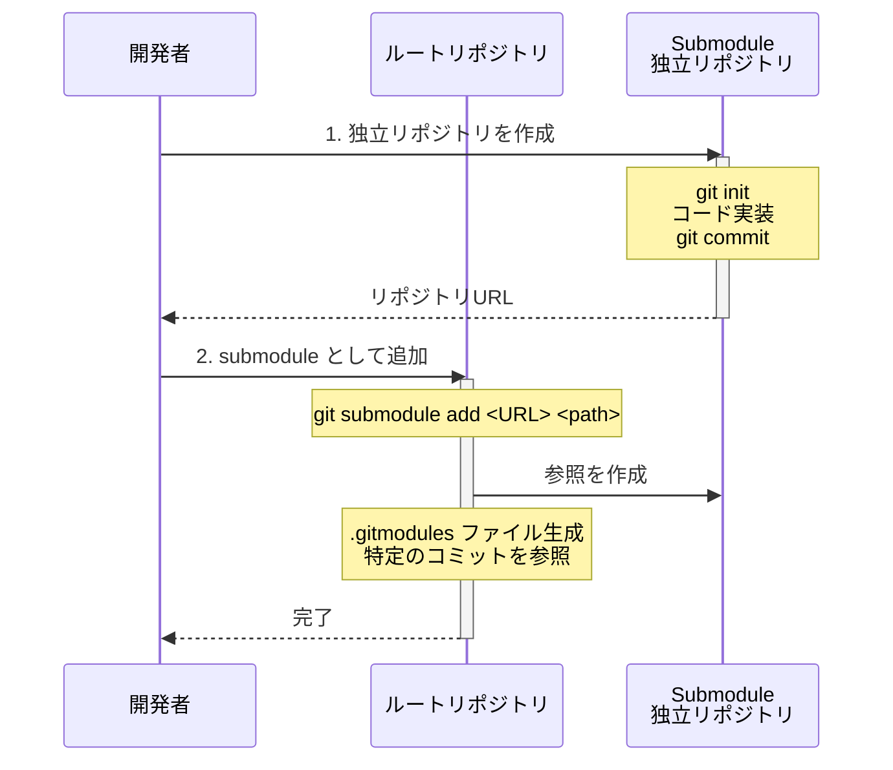
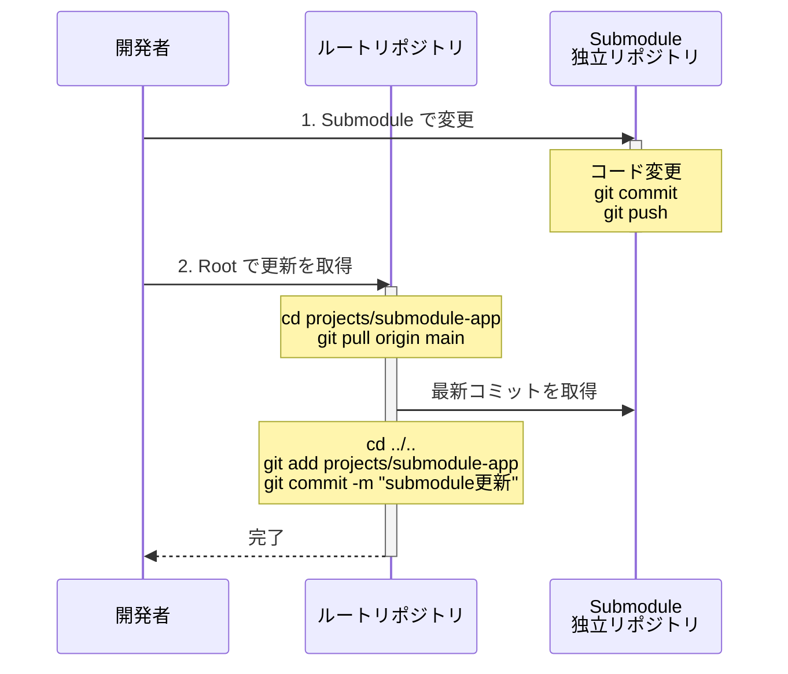
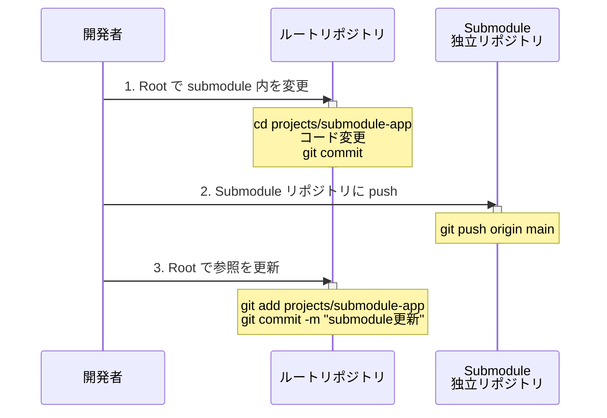
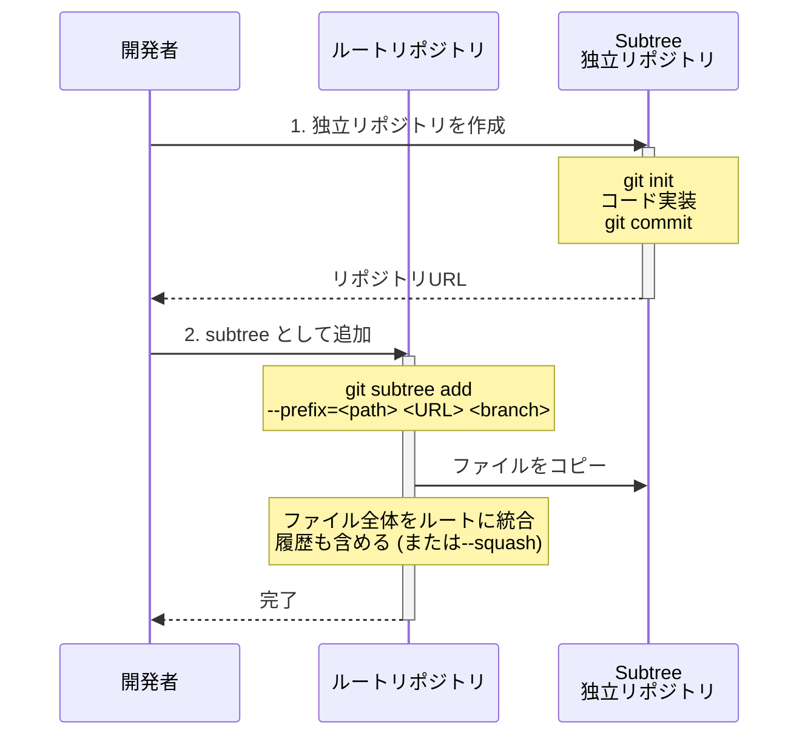
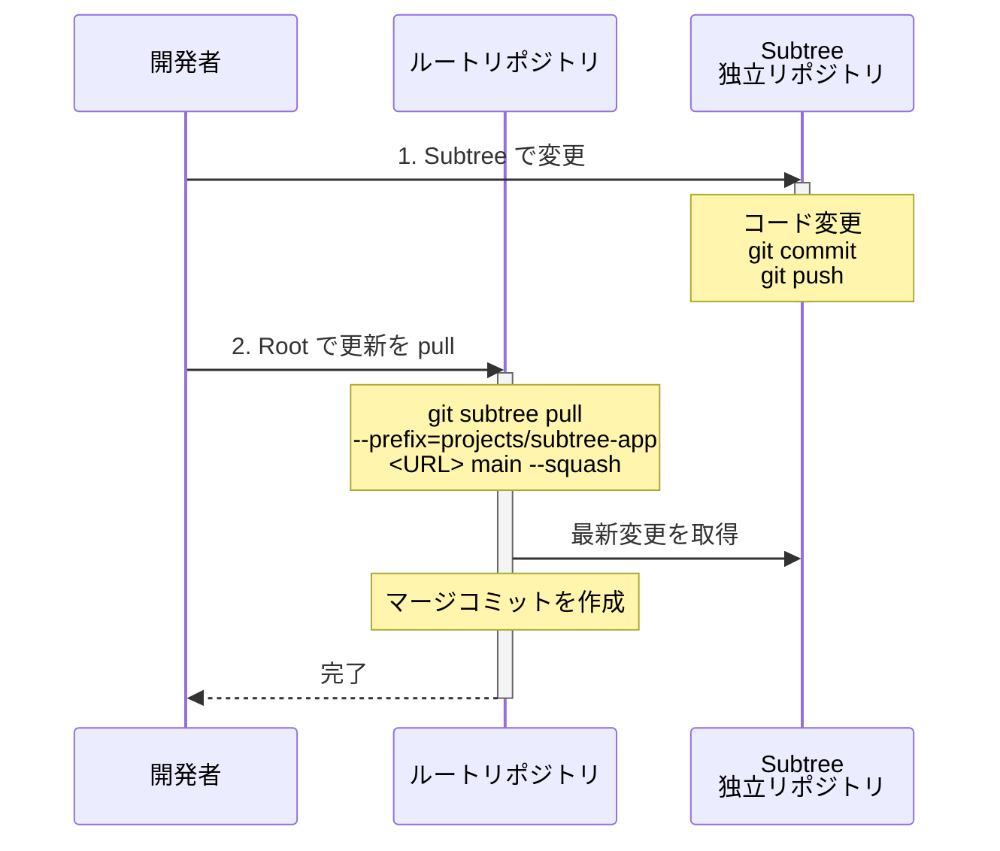
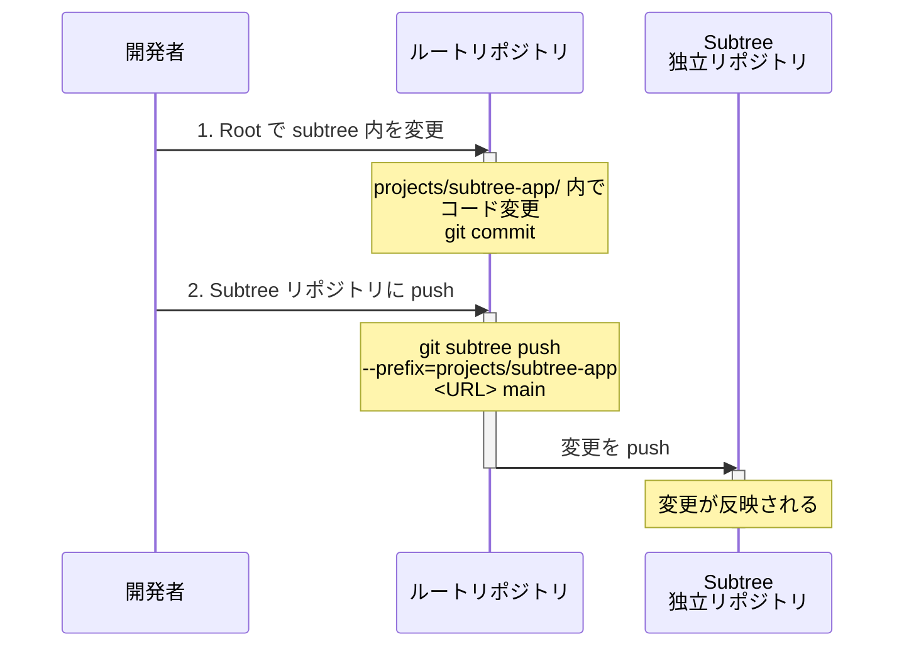
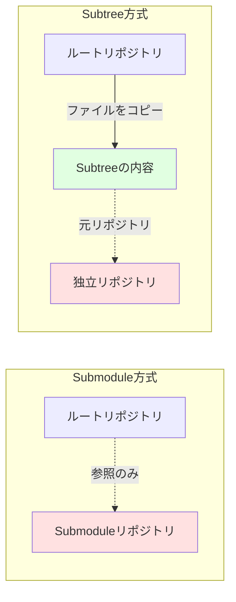
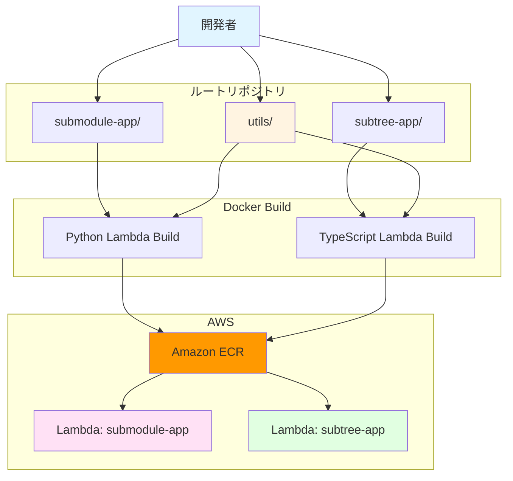

# Git Submodule vs Subtree ワークフロー

このドキュメントでは、git submodule と git subtree の運用フローを図解します。

## 📊 プロジェクト構成図

```mermaid
graph TB
    Root[ルートリポジトリ<br/>git_submodule_subtree_demo]
    Utils[projects/utils/<br/>共通ユーティリティ<br/>ルート管理]
    Submodule[projects/submodule-app/<br/>Python Lambda<br/>git submodule]
    Subtree[projects/subtree-app/<br/>TypeScript Lambda<br/>git subtree]

    SubmoduleRepo[/tmp/demo-repos/submodule-app<br/>独立リポジトリ]
    SubtreeRepo[/tmp/demo-repos/subtree-app<br/>独立リポジトリ]

    Root --> Utils
    Root -.参照.-> Submodule
    Root --> Subtree

    Submodule -.git submodule<br/>参照.-> SubmoduleRepo
    Subtree -.git subtree<br/>コピー元.-> SubtreeRepo

    Submodule -.-|参照| Utils
    Subtree -.-|参照| Utils

    style Root fill:#e1f5ff
    style Utils fill:#fff4e1
    style Submodule fill:#ffe1f5
    style Subtree fill:#e1ffe1
    style SubmoduleRepo fill:#ffe1e1
    style SubtreeRepo fill:#ffe1e1
```

## 🔄 Git Submodule ワークフロー

### 初期セットアップ



### 更新フロー (Submodule → Root)



### 更新フロー (Root → Submodule)



## 🌳 Git Subtree ワークフロー

### 初期セットアップ



### 更新フロー (Subtree → Root)



### 更新フロー (Root → Subtree)



## ⚖️ Submodule vs Subtree の違い

### データ管理の違い



### コマンド比較表

| 操作 | Git Submodule | Git Subtree |
|------|---------------|-------------|
| **初期追加** | `git submodule add <URL> <path>` | `git subtree add --prefix=<path> <URL> <branch>` |
| **更新取得** | `cd <path> && git pull`<br/>+ `git add <path> && git commit` | `git subtree pull --prefix=<path> <URL> <branch>` |
| **変更送信** | `cd <path> && git push`<br/>+ 親でコミット | `git subtree push --prefix=<path> <URL> <branch>` |
| **クローン時** | `git clone --recurse-submodules` または<br/>`git submodule update --init --recursive` | 通常の `git clone` で完結 |
| **履歴管理** | 参照のみ（別リポジトリ） | ルートに統合される |

## 🐳 Docker Build との連携

### Build Context の考慮

```mermaid
graph TB
    BuildContext[Docker Build Context<br/>projects/]

    Submodule[submodule-app/<br/>Dockerfile]
    Subtree[subtree-app/<br/>Dockerfile]
    Utils[utils/<br/>共通ファイル]

    BuildContext --> Submodule
    BuildContext --> Subtree
    BuildContext --> Utils

    Submodule -.COPY utils/ .-.-> Utils
    Subtree -.COPY utils/ .-.-> Utils

    style BuildContext fill:#e1f5ff
    style Utils fill:#fff4e1
```

**ポイント**:
- Docker build context は `projects/` ディレクトリに設定
- 両方の Dockerfile から `COPY utils/` で共通ファイルを参照可能
- submodule でも subtree でも同じ方法で build できる

## 🚀 Lambda デプロイフロー



## 📝 まとめ

### Git Submodule の特徴

**長所**:
- 各リポジトリが完全に独立
- 履歴が分離されている
- 大規模なモノレポに適している

**短所**:
- クローン時に追加手順が必要
- 更新が複雑（2段階のcommitが必要）
- 初心者には分かりにくい

### Git Subtree の特徴

**長所**:
- クローンが簡単（通常のgit cloneで完結）
- ルート側での作業が直感的
- 履歴がルートに統合される

**短所**:
- push/pull コマンドが長い
- 履歴が混ざる可能性
- リポジトリサイズが大きくなる

### 推奨事項

| シナリオ | 推奨 | 理由 |
|---------|------|------|
| 完全に独立した開発チーム | Submodule | 各チームが独自のリポジトリで作業 |
| 頻繁に統合する小規模プロジェクト | Subtree | クローンと統合が簡単 |
| CI/CDでの自動化 | Subtree | 追加セットアップ不要 |
| 複数バージョンの管理 | Submodule | 特定コミットへの固定が容易 |
